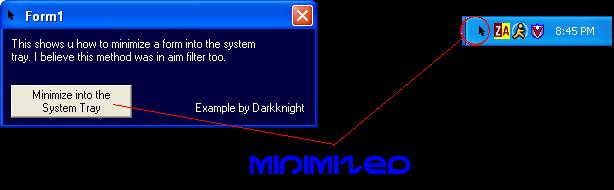



## Minimize into System Tray

### Description

This example shows you how to make a form minimize into the system tray. I have made an updated one of this. Please visit my 'System Tray Minimize V2' source code for the updated one.
 
### More Info
 

             |
---                |---
**Submitted On**   |2002-03-12 20:52:20
**By**             |[DarkKnightH20](https://github.com/Planet-Source-Code/PSCIndex/blob/master/ByAuthor/darkknighth20.md)
**Level**          |Intermediate
**User Rating**    |5.0 (20 globes from 4 users)
**Compatibility**  |VB 6\.0
**Category**       |[Miscellaneous](https://github.com/Planet-Source-Code/PSCIndex/blob/master/ByCategory/miscellaneous__1-1.md)
**World**          |[Visual Basic](https://github.com/Planet-Source-Code/PSCIndex/blob/master/ByWorld/visual-basic.md)
**Archive File**   |[Minimize\_i616993122002\.zip](https://github.com/Planet-Source-Code/darkknighth20-minimize-into-system-tray__1-32632/archive/master.zip)

